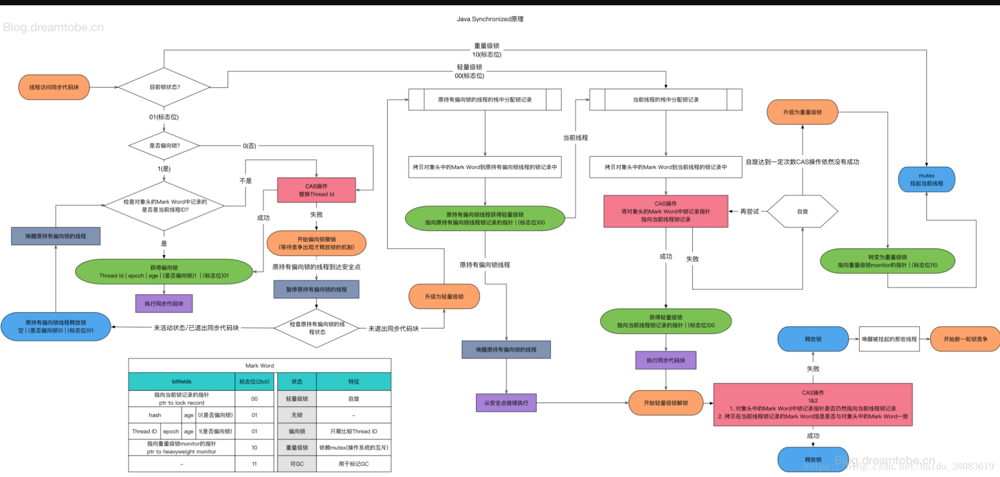
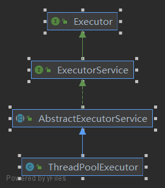

# juc
learn juc

### 锁升级过程图解



### 原子类源码分析 CAS
> 以 AtomicInteger 为例。

在使用 `AtomicInteger` 类时，加 1 操作会调用方法 `incrementAndGet()`,这个方法就是 CAS 的实现。
先瞥一眼这个方法的内容， 实际上就是拿到 value 的值，然后再执行加 1 的操作。
```java
public class AtomicInteger extends Number implements java.io.Serializable {

	private static final jdk.internal.misc.Unsafe U = jdk.internal.misc.Unsafe.getUnsafe();
      /**
        * Unsafe 类直接操作内存
        * 这个 VALUE 的值就是 AtomicInteger 类 value 的内存位置地址的偏移量，
        * 通过 native 方法，拿到地址指针
	*/
	private static final long VALUE = U.objectFieldOffset(AtomicInteger.class, "value");

	private volatile int value;
	
	public final int incrementAndGet() {
		return U.getAndAddInt(this, VALUE, 1) + 1;
	}
	// 省略其他方法
}
```
再跟踪到 `getAndAddInt()` 方法中，进到了 `Unsafe` 类中，如下：
```java
public final class Unsafe {
	...
	@HotSpotIntrinsicCandidate
	public final int getAndAddInt(Object o, long offset, int delta) {
		int v;
		do {
			v = getIntVolatile(o, offset);
		} while (!weakCompareAndSetInt(o, offset, v, v + delta));
		return v;
	}
	...
}
```
这个就是 CAS 的核心实现，流程如下：
1. do 里面，先去拿 this 对象在偏移量为 offset 的值，v 取到的是 0；
2. 然后 while 中 `weakCompareAndSetInt()` 方法再去判断这个偏移量位置上是不是 0，也就是期望的应该是0，
  - 2.1 如果是 0，就把 0 + 1 = 1 写进去；
  - 2.2 如果不是 0，说明在取到 0 后，有其他线程修改了这个 offset 位置的值，比如 1
  - 2.3 然后又执行一次 do 里面的操作，拿到 v = 1，再去看看这个 offset 位置上的值是不是1，是就加上1，不是继续 do..while 操作
  - 2.4 成功了就结束。
3. 然后返回了 v，注意，这个 v 的值还是刚才取到的 0，并没有重新去取。

这里有个问题，有没有可能这样的情况出现，do 里面取到了是 0，然后比较了当前的位置确实是 0 ，然后再写的过程值
又发生了变化呢？ 答案是不可能。  
我们进到 `weakCompareAndSetObject(Object o, long offset,Object expected,Object x)` 方法
里面看一下源代码：
```java
public final class Unsafe {
    @HotSpotIntrinsicCandidate
    public final boolean weakCompareAndSetObject(Object o, long offset,
                                                 Object expected,
	                                             Object x) {
        return compareAndSetObject(o, offset, expected, x);
	}

    /**
     * 如果当前持有expected则以原子方式将 Java 变量更新为x
     * 此操作具有volatile读写的内存语义。 对应于 C11 atomic_compare_exchange_strong。
     * 返回：如果成功则为true
     */
    @HotSpotIntrinsicCandidate
    public final native boolean compareAndSetInt(Object o, long offset,
	                                        int expected,
	                                        int x);

}
```
我们可以看到注释里面 `atomic_compare_exchange_strong` 函数，这是 C11 原子的函数，反映到处理器的指令上
就是 `CMPXCHG` 指令，这条指令已经无法再分割，而这条指令执行的时候，通过锁总线来让其他核心处理器都不能访问这个地址。
简单来说，从 CPU 原语的级别来保证了 CAS 的操作。

#### CAS 的 ABA
当然 CAS 属于无锁优化，也可以说是乐观锁，但是存在 ABA 的问题，即当前线程取回的值和期望的是一致的，但是中间某个线程操作了这个值，然后又恢复了这个值
，并且不会影响当前线程的后续操作，实际上是发生了改变，但是 ABA 可以分类型来考虑。
  - 如果是基础类型，那么改变的值不影响当前线程要用的值。
  - 如果是引用类型的话，那么在某些场景下会影响结果，就好比你的女朋友和你分手又复合了，但是中间经历了别的男人。
如何解决 ABA 的问题呢，**可以加一个版本标记，任何一次修改，就会修改这个版本标记，检查的时候版本标记也要一起检查。**

### JUC 类总结  
  - ReentrantLock 比 synchronized 更灵活，更方便，lock() 和 unlock() 配对使用；
  - CountDownLatch 倒计时为 0，门栓打开，countDown() 和 await() 配对使用；
  - CycliBarrier  栅栏，循环使用， 人满，栅栏放行，定义 runnable 推倒之后的操作和 await() 使用；
  - Phaser 分阶段的栅栏，继承 Phaser 重写 onAdvance()，arriveAndAwaitAdvance() 到了注册 和 arriveAndDeregister() 走了注销
  - Semaphore 限流，acquire() 和 release() 配对使用
  - Exchanger 两个线程之间相互交换数据，定义交换类型，调用 exchange(T) 方法交换数据；

### Synchronized 和 ReentrantLock 的区别
  - Synchronized 是系统自带的，系统自动加锁，自动解锁，默认进行四种锁状态的升级， wait() 和 notify() 必须用在 synchronized 代码块中，用于多线程协调运行，必须是在有锁的对象上使用。（Lost wake-up problem）
  - ReentrantLock 需要手动加锁，手动解锁，CAS 的实现。


### 通过 ReentrantLock 来分析 AQS 源码

在使用 `ReentrantLock` 类时，调用 lock() 方法，我们先来看一下 lock() 方法：
```java
public class ReentrantLock implements Lock, java.io.Serializable {

	private final Sync sync;

	abstract static class Sync extends AbstractQueuedSynchronizer {
		...
    }
	...
	public void lock() {
		sync.acquire(1);
	}
	...
}
```
看到 sync.acquire(1)，sync 是 _ReentrantLock_ 的内部类，继承了 `AbstractQueuedSynchronizer` (AQS)，而 acquire(1) 方法是属于 AQS 的，我们进到里面看看：
```java
public abstract class AbstractQueuedSynchronizer extends AbstractOwnableSynchronizer implements java.io.Serializable {
	public final void acquire(int arg) {
		if (!tryAcquire(arg) &&
			acquireQueued(addWaiter(Node.EXCLUSIVE), arg))
			selfInterrupt();
	}
}
```
if 条件的两个并列条件，首先是第一个 tryAcquire(1)，这个方法的作用是尝试获得锁，如果当前的锁获取不到就会执行第二个条件，尝试加入队列，如果有任何中断直接中断。
先进到 tryAcquire(1) 方法看看：
```java
public abstract class AbstractQueuedSynchronizer extends AbstractOwnableSynchronizer implements java.io.Serializable {
	protected boolean tryAcquire(int arg) {
		throw new UnsupportedOperationException();
	}
}
```
这个方法没有实现，说明留给子类去做实现，这里使用到了模板方法设计模式，在 ReentrantLock 类中，默认是非公平锁，所以内部类 _NonfairSync_ 实现了 tryAcquire(1) 方法，
该类继承了 Sync，而根据上述 Sync 继承了 AQS 类。我们看来 ReentrantLock 中 的 _NonfairSync_ 类的结构：
```java
public class ReentrantLock implements Lock, java.io.Serializable {

	static final class NonfairSync extends Sync {
		private static final long serialVersionUID = 7316153563782823691L;

		protected final boolean tryAcquire(int acquires) {
			return nonfairTryAcquire(acquires);
		}
	}
}
```
_NonfairSync_ 类里面又调用父类 _Sync_ 的 nonfairTryAcquire(1)，至此，我们到了获取锁的核心方法。
```java
public class ReentrantLock implements Lock, java.io.Serializable {

	abstract static class Sync extends AbstractQueuedSynchronizer {
		private static final long serialVersionUID = -5179523762034025860L;

		/**
		 * Performs non-fair tryLock.  tryAcquire is implemented in
		 * subclasses, but both need nonfair try for trylock method.
		 */
		@ReservedStackAccess
		final boolean nonfairTryAcquire(int acquires) {
			final Thread current = Thread.currentThread();  // 获取当前线程
			int c = getState();  // 获取当前状态，这个方法是 AQS 里面的方法，拿到的是 volatile 的 state 值，具体 state 值怎么用是子类要干的事情
			if (c == 0) {
				if (compareAndSetState(0, acquires)) {
					setExclusiveOwnerThread(current);
					return true;
				}
			} else if (current == getExclusiveOwnerThread()) {
				int nextc = c + acquires;
				if (nextc < 0) // overflow
					throw new Error("Maximum lock count exceeded");
				setState(nextc);
				return true;
			}
			return false;
		}
	}
}
```
拿到 state 值以后，if 条件中，判断 state 的值，如果 state 值为 0 ，说明还没有线程拿到锁，然后 CAS 齐昂锁，如果抢锁成功，那么 state 值为 1，并且把当前线程设置为独占锁；
如果 state 值不是 0， 说明已经有其他的线程占用了这个锁；else if 的条件分支中，再判断一下已经拿到这个锁的是不是自己，如果是自己的话，就把 state + 1，释放的时候会 - 1。
在判断 state 值既不是 0，也不是当前线程持有锁，那么一定是其他线程正在持有锁，返回 false。  
那么在 AbstractQueuedSynchronizer 类中 acquire(1)方法的第一个 if 条件 tryAcquire(1) 是 false，说明 ReentrantLock实例在调用 lock() 方法没有拿到锁，那就执行
if 并列条件的第二个方法 acquireQueued(addWaiter(Node.EXCLUSIVE), arg))，这个方法是尝试加入到等待队列中。  
首先我们来看 addWaiter() 方法：
```java
public abstract class AbstractQueuedSynchronizer extends AbstractOwnableSynchronizer implements java.io.Serializable {

	private Node addWaiter(Node mode) {
		Node node = new Node(mode);

		for (; ; ) {
			Node oldTail = tail;
			if (oldTail != null) {
				node.setPrevRelaxed(oldTail);
				if (compareAndSetTail(oldTail, node)) {
					oldTail.next = node;
					return node;
				}
			} else {
				initializeSyncQueue();
			}
		}
	}
}
```
这里我们看到这个方法返回 _Node_ 类，这个 _Node_ 类是什么呢？我们看一下 _Node_ 类的定义：

<details>
<summary><b>点击展开:</b> AQS 的内部类 Node 类</summary>
    
```java
public abstract class AbstractQueuedSynchronizer extends AbstractOwnableSynchronizer implements java.io.Serializable {

    /**
     * Wait queue node class.
     *
     * <p>The wait queue is a variant of a "CLH" (Craig, Landin, and
     * Hagersten) lock queue. CLH locks are normally used for
     * spinlocks.  We instead use them for blocking synchronizers, but
     * use the same basic tactic of holding some of the control
     * information about a thread in the predecessor of its node.  A
     * "status" field in each node keeps track of whether a thread
     * should block.  A node is signalled when its predecessor
     * releases.  Each node of the queue otherwise serves as a
     * specific-notification-style monitor holding a single waiting
     * thread. The status field does NOT control whether threads are
     * granted locks etc though.  A thread may try to acquire if it is
     * first in the queue. But being first does not guarantee success;
     * it only gives the right to contend.  So the currently released
     * contender thread may need to rewait.
     *
     * <p>To enqueue into a CLH lock, you atomically splice it in as new
     * tail. To dequeue, you just set the head field.
     * <pre>
     *      +------+  prev +-----+       +-----+
     * head |      | <---- |     | <---- |     |  tail
     *      +------+       +-----+       +-----+
     * </pre>
     *
     * <p>Insertion into a CLH queue requires only a single atomic
     * operation on "tail", so there is a simple atomic point of
     * demarcation from unqueued to queued. Similarly, dequeuing
     * involves only updating the "head". However, it takes a bit
     * more work for nodes to determine who their successors are,
     * in part to deal with possible cancellation due to timeouts
     * and interrupts.
     *
     * <p>The "prev" links (not used in original CLH locks), are mainly
     * needed to handle cancellation. If a node is cancelled, its
     * successor is (normally) relinked to a non-cancelled
     * predecessor. For explanation of similar mechanics in the case
     * of spin locks, see the papers by Scott and Scherer at
     * http://www.cs.rochester.edu/u/scott/synchronization/
     *
     * <p>We also use "next" links to implement blocking mechanics.
     * The thread id for each node is kept in its own node, so a
     * predecessor signals the next node to wake up by traversing
     * next link to determine which thread it is.  Determination of
     * successor must avoid races with newly queued nodes to set
     * the "next" fields of their predecessors.  This is solved
     * when necessary by checking backwards from the atomically
     * updated "tail" when a node's successor appears to be null.
     * (Or, said differently, the next-links are an optimization
     * so that we don't usually need a backward scan.)
     *
     * <p>Cancellation introduces some conservatism to the basic
     * algorithms.  Since we must poll for cancellation of other
     * nodes, we can miss noticing whether a cancelled node is
     * ahead or behind us. This is dealt with by always unparking
     * successors upon cancellation, allowing them to stabilize on
     * a new predecessor, unless we can identify an uncancelled
     * predecessor who will carry this responsibility.
     *
     * <p>CLH queues need a dummy header node to get started. But
     * we don't create them on construction, because it would be wasted
     * effort if there is never contention. Instead, the node
     * is constructed and head and tail pointers are set upon first
     * contention.
     *
     * <p>Threads waiting on Conditions use the same nodes, but
     * use an additional link. Conditions only need to link nodes
     * in simple (non-concurrent) linked queues because they are
     * only accessed when exclusively held.  Upon await, a node is
     * inserted into a condition queue.  Upon signal, the node is
     * transferred to the main queue.  A special value of status
     * field is used to mark which queue a node is on.
     *
     * <p>Thanks go to Dave Dice, Mark Moir, Victor Luchangco, Bill
     * Scherer and Michael Scott, along with members of JSR-166
     * expert group, for helpful ideas, discussions, and critiques
     * on the design of this class.
     */
    static final class Node {
        /** Marker to indicate a node is waiting in shared mode */
        static final Node SHARED = new Node();
        /** Marker to indicate a node is waiting in exclusive mode */
        static final Node EXCLUSIVE = null;

        /** waitStatus value to indicate thread has cancelled. */
        static final int CANCELLED =  1;
        /** waitStatus value to indicate successor's thread needs unparking. */
        static final int SIGNAL    = -1;
        /** waitStatus value to indicate thread is waiting on condition. */
        static final int CONDITION = -2;
        /**
         * waitStatus value to indicate the next acquireShared should
         * unconditionally propagate.
         */
        static final int PROPAGATE = -3;

        /**
         * Status field, taking on only the values:
         *   SIGNAL:     The successor of this node is (or will soon be)
         *               blocked (via park), so the current node must
         *               unpark its successor when it releases or
         *               cancels. To avoid races, acquire methods must
         *               first indicate they need a signal,
         *               then retry the atomic acquire, and then,
         *               on failure, block.
         *   CANCELLED:  This node is cancelled due to timeout or interrupt.
         *               Nodes never leave this state. In particular,
         *               a thread with cancelled node never again blocks.
         *   CONDITION:  This node is currently on a condition queue.
         *               It will not be used as a sync queue node
         *               until transferred, at which time the status
         *               will be set to 0. (Use of this value here has
         *               nothing to do with the other uses of the
         *               field, but simplifies mechanics.)
         *   PROPAGATE:  A releaseShared should be propagated to other
         *               nodes. This is set (for head node only) in
         *               doReleaseShared to ensure propagation
         *               continues, even if other operations have
         *               since intervened.
         *   0:          None of the above
         *
         * The values are arranged numerically to simplify use.
         * Non-negative values mean that a node doesn't need to
         * signal. So, most code doesn't need to check for particular
         * values, just for sign.
         *
         * The field is initialized to 0 for normal sync nodes, and
         * CONDITION for condition nodes.  It is modified using CAS
         * (or when possible, unconditional volatile writes).
         */
        volatile int waitStatus;

        /**
         * Link to predecessor node that current node/thread relies on
         * for checking waitStatus. Assigned during enqueuing, and nulled
         * out (for sake of GC) only upon dequeuing.  Also, upon
         * cancellation of a predecessor, we short-circuit while
         * finding a non-cancelled one, which will always exist
         * because the head node is never cancelled: A node becomes
         * head only as a result of successful acquire. A
         * cancelled thread never succeeds in acquiring, and a thread only
         * cancels itself, not any other node.
         */
        volatile Node prev;

        /**
         * Link to the successor node that the current node/thread
         * unparks upon release. Assigned during enqueuing, adjusted
         * when bypassing cancelled predecessors, and nulled out (for
         * sake of GC) when dequeued.  The enq operation does not
         * assign next field of a predecessor until after attachment,
         * so seeing a null next field does not necessarily mean that
         * node is at end of queue. However, if a next field appears
         * to be null, we can scan prev's from the tail to
         * double-check.  The next field of cancelled nodes is set to
         * point to the node itself instead of null, to make life
         * easier for isOnSyncQueue.
         */
        volatile Node next;

        /**
         * The thread that enqueued this node.  Initialized on
         * construction and nulled out after use.
         */
        volatile Thread thread;

        /**
         * Link to next node waiting on condition, or the special
         * value SHARED.  Because condition queues are accessed only
         * when holding in exclusive mode, we just need a simple
         * linked queue to hold nodes while they are waiting on
         * conditions. They are then transferred to the queue to
         * re-acquire. And because conditions can only be exclusive,
         * we save a field by using special value to indicate shared
         * mode.
         */
        Node nextWaiter;

        /**
         * Returns true if node is waiting in shared mode.
         */
        final boolean isShared() {
            return nextWaiter == SHARED;
        }

        /**
         * Returns previous node, or throws NullPointerException if null.
         * Use when predecessor cannot be null.  The null check could
         * be elided, but is present to help the VM.
         *
         * @return the predecessor of this node
         */
        final Node predecessor() {
            Node p = prev;
            if (p == null)
                throw new NullPointerException();
            else
                return p;
        }

        /** Establishes initial head or SHARED marker. */
        Node() {}

        /** Constructor used by addWaiter. */
        Node(Node nextWaiter) {
            this.nextWaiter = nextWaiter;
            THREAD.set(this, Thread.currentThread());
        }

        /** Constructor used by addConditionWaiter. */
        Node(int waitStatus) {
            WAITSTATUS.set(this, waitStatus);
            THREAD.set(this, Thread.currentThread());
        }

        /** CASes waitStatus field. */
        final boolean compareAndSetWaitStatus(int expect, int update) {
            return WAITSTATUS.compareAndSet(this, expect, update);
        }

        /** CASes next field. */
        final boolean compareAndSetNext(Node expect, Node update) {
            return NEXT.compareAndSet(this, expect, update);
        }

        final void setPrevRelaxed(Node p) {
            PREV.set(this, p);
        }

        // VarHandle mechanics
        private static final VarHandle NEXT;
        private static final VarHandle PREV;
        private static final VarHandle THREAD;
        private static final VarHandle WAITSTATUS;
        static {
            try {
                MethodHandles.Lookup l = MethodHandles.lookup();
                NEXT = l.findVarHandle(Node.class, "next", Node.class);
                PREV = l.findVarHandle(Node.class, "prev", Node.class);
                THREAD = l.findVarHandle(Node.class, "thread", Thread.class);
                WAITSTATUS = l.findVarHandle(Node.class, "waitStatus", int.class);
            } catch (ReflectiveOperationException e) {
                throw new ExceptionInInitializerError(e);
            }
        }
    }
}
```

</details>
总结一下就是，上面说到的等待队列是由一个双向链表实现的，这个队列是 CLH 队列的变种，把 synchronized 换成了 CAS， 而 Node 类就是这个双向链表带有线程信息的节点类。
Node 只有两种模式，EXCLUSIVE 和 SHARED，还有个成员变量 waitStatus，有几种状态，注释文档说的很清楚，最重要的是 SIGNAL 状态，表示当前的线程的后继节点正在阻塞等待，
当前线程释放锁或者取消后需要唤醒它的后继节点。
> 为什么是双向链表，单向的行不行？ 行，但是还是不够好，如果我要找到某个 node 的前一个节点，时间复杂度就是 O(n)，如果是双向链表就是 O(1)。

继续看 addWaiter(Node.EXCLUSIVE)方法，首先拿到等待队列的 tail 节点，如果为空就初始化一个队列，头尾都是指向这个 node；
如果 tail 存在，就把要添加的这个 node 的 prev 指向 tail 节点，因为在操作的过程中，可能其他的线程改动了 tail，所以需要
CAS 自旋的把 tail 节点的 next 指向这个要添加的 node。一句话就是：addWaiter() 方法就是添加 node 到等待队列的队尾。
然后返回这个 node。

添加到队尾之后，执行 acquireQueued(Node.EXCLUSIVE,1)方法，再看一下这个方法：
```java
public abstract class AbstractQueuedSynchronizer extends AbstractOwnableSynchronizer implements java.io.Serializable {

	/**
	 * Acquires in exclusive uninterruptible mode for thread already in
	 * queue. Used by condition wait methods as well as acquire.
	 *
	 * @param node the node
	 * @param arg the acquire argument
	 * @return {@code true} if interrupted while waiting
	 */
	final boolean acquireQueued(final Node node, int arg) {
		boolean interrupted = false;
		try {
			for (; ; ) {
				final Node p = node.predecessor();
				if (p == head && tryAcquire(arg)) {
					setHead(node);
					p.next = null; // help GC
					return interrupted;
				}
				if (shouldParkAfterFailedAcquire(p, node))
					interrupted |= parkAndCheckInterrupt();
			}
		} catch (Throwable t) {
			cancelAcquire(node);
			if (interrupted)
				selfInterrupt();
			throw t;
		}
	}
}

```

首先去拿这个 node 的 prev 节点，先判断一下是不是头结点，然后再去 tryAcquire(1) ，看看能不能拿到锁，万一头结点刚好释放锁呢，拿到锁之后，
说明头结点释放了锁，把这个 node 设置为头结点，然后头结点的 next 节点设置为 null，这样头结点就不会有引用存在，帮助 GC 回收，如果有中断就返回了。
如果说，这个 node 的 prev 节点不是头结点或者没有拿到锁，那么进入下面一个条件判断，进入方法 shouldParkAfterFailedAcquire()：
```java
public abstract class AbstractQueuedSynchronizer extends AbstractOwnableSynchronizer implements java.io.Serializable {

	/**
	 * Checks and updates status for a node that failed to acquire.
	 * Returns true if thread should block. This is the main signal
	 * control in all acquire loops.  Requires that pred == node.prev.
	 *
	 * @param pred node's predecessor holding status
	 * @param node the node
	 * @return {@code true} if thread should block
	 */
	private static boolean shouldParkAfterFailedAcquire(Node pred, Node node) {
		int ws = pred.waitStatus;
		if (ws == Node.SIGNAL)
			/*
			 * This node has already set status asking a release
			 * to signal it, so it can safely park.
			 */
			return true;
		if (ws > 0) {
			/*
			 * Predecessor was cancelled. Skip over predecessors and
			 * indicate retry.
			 */
			do {
				node.prev = pred = pred.prev;
			} while (pred.waitStatus > 0);
			pred.next = node;
		} else {
			/*
			 * waitStatus must be 0 or PROPAGATE.  Indicate that we
			 * need a signal, but don't park yet.  Caller will need to
			 * retry to make sure it cannot acquire before parking.
			 */
			pred.compareAndSetWaitStatus(ws, Node.SIGNAL);
		}
		return false;
	}
}
```

在看这个方法前，我们看一下参数，进到这个方法的前提是，如果参数 pred 不是头结点，当前线程也没有拿到锁，那么是不是应该等一下？
首先拿到 pred 这个 node 的状态，判断：
如果 pred 这个 node 的状态是 SINGAL，表示 pred 的这个 node 待会释放锁的时候会唤醒后继节点，也就是参数 node 指向的这个 Node，实际上就是当前的 node，那么返回 true，就是要等一会；
如果 pred 这个 node 的状态是大于 0，大于 0 的状态是 CANCELLED 的状态，可能这个线程 node 被取消调度或者timeout，那么就再去找 pred 的这个 node 的前驱节点，反正一直找到不是 CANCELLED 状态的节点；
如果 pred 这个 node 的状态是小于等于 0， waitStatus 默认是 0，小于 0 是处在 CONDITION 和 PROPAGATE 的状态，把 pred 的这个 node 的状态 CAS 设置成 SIGNAL 状态，
最后返回 false。总结一下，实际上就是当前的线程节点加塞成为即将被唤醒的节点，坏得很~

我们再回到方法 acquireQueued(Node.EXCLUSIVE, 1) 中，如果 shouldParkAfterFailedAcquire() 返回是 true，那么就是执行 parkAndCheckInterrupt()，即：
```java
public abstract class AbstractQueuedSynchronizer extends AbstractOwnableSynchronizer implements java.io.Serializable {

	/**
	 * Convenience method to park and then check if interrupted.
	 *
	 * @return {@code true} if interrupted
	 */
	private final boolean parkAndCheckInterrupt() {
		LockSupport.park(this);
		return Thread.interrupted();
	}
}
```
这个方法就是调用同步辅助工具类 LockSupport.park(this)，阻塞住当前线程。

最后，如果在 lock() 的整个过程中拿到了锁，就会继续执行后面的程序，如果没有就阻塞住，这就是整个 AQS 的源码基本思路。

我们再来关注一下 AQS 为什么效率高？
主要是 AQS 采用 CAS 来操作链表尾巴，如果好多线程都要往链表尾巴上插入节点，第一想法肯定会加锁，锁定整个 (Sync) 对象，保证线程安全，
但是锁定整个链表的话，锁的太多太大了，现在 AQS 并不是锁定整个链表的方法，而是观测 tail 这个节点就可以了，用 CAS 是做实现，这就是
AQS 效率高的核心。


### 并发容器类

Queue 和 List 有什么区别？
Queue 无非就是比 List 多了一些友好的方法，比如 offer()，peek()， poll()，子类 BlockingQueue还增加了线程阻塞的方法 put(), take()


### 线程池

**（1）线程池类关系图**  


Executors 是对线程执行的工具类，可以看做是线程池的工厂。

execute 里面执行，submit 等待线程自己调度运行。

**（2）线程池核心参数的交互**  
  - `corePoolSize` 核心线程数
  - `maximumPoolSize` 最大线程数
  - `keepAliveTime` 生存时间，线程池中超过核心线程数大小的线程的存活时间，如果设置 `allowCoreThreadTimeOut` 为 `true`，那么核心线程数也是此时间的存活时间 
  - `unit` 生存时间的单位，类型是 _`TimeUnit`_
  - `workQueue` 任务队列 _`BlockingQueue<Runnable>`_
  - `threadFactory` 线程工厂 _ThreadFactory_
  - `handler` 拒绝策略， 类型是 _`RejectedExecutionHandler`_

首先线程池中会保持 corePoolSize 大小的线程运行，即使没有任务也会空闲运行，但是如果设置了 allowCoreThreadTimeOut = true，
那么核心线程也会在 keepAliveTime 时间大小之后关闭。当任务超过了核心线程数的话，会把新的任务放到工作队列，
如果工作队列满了，并且当前的工作线程是小于 maximumPoolSize 定义的最大线程数的，那么创建一个新线程来运行任务，
当运行的线程数超过了最大线程数的值，拒绝策略开始发挥作用，默认是丢弃策略。

### 线程池源码分析

终于来到了我们的线程池的源码解析啦，因为我们知道jdk自带的各种线程池本质上都是核心类 `ThreadPollExecutor` 构造出来的，所以我们来看里面到到底是个
什么鬼？

  - #### 成员变量

```java
public class ThreadPoolExecutor extends AbstractExecutorService {
	
	// 高 3 位表示线程池状态，低29位表示 worker 的数量
	private final AtomicInteger ctl = new AtomicInteger(ctlOf(RUNNING, 0));
	private static final int COUNT_BITS = Integer.SIZE - 3;  // 32 - 3 = 29
	
	/**
	 *   0010 0000 0000 0000 0000 0000 0000 0000      COUNT_BITS 二进制值
	   - 0000 0000 0000 0000 0000 0000 0000 0001        1 二进制值
	 ————————————————————————————————————————————
	   = 0001 1111 1111 1111 1111 1111 1111 1111      COUNT_MASK 二进制值
	 * */
	private static final int COUNT_MASK = (1 << COUNT_BITS) - 1; // 1 * 2^29 -1
	
	// runState is stored in the high-order bits
	private static final int RUNNING    = -1 << COUNT_BITS;  // 表示接收新任务和处理队列中的任务
	private static final int SHUTDOWN   =  0 << COUNT_BITS;  // 表示不接收新任务了，但是会处理队列中的任务
	private static final int STOP       =  1 << COUNT_BITS;  // 表示不接收新任务，也不处理队列中的任务，中断进行中的任务
	private static final int TIDYING    =  2 << COUNT_BITS;  // 如果所有的任务的已经结束，工作线程是0，此时的线程状态转变为 TIDYING，调用 terminated() 钩子方法
	private static final int TERMINATED =  3 << COUNT_BITS;  // 表示 terminated() 方法执行完成

	// Packing and unpacking ctl
	// ~COUNT_MASK 值: 1110 0000 0000 0000 0000 0000 0000 0000  
	// 按位与，低 29 位都是 0
	private static int runStateOf(int c)     { return c & ~COUNT_MASK; }
	
	// COUNT_MASK 二进制值 : 0001 1111 1111 1111 1111 1111 1111 1111 
	// 按位与，高 3 位都是 0
	private static int workerCountOf(int c)  { return c & COUNT_MASK; }
	
	// 根据线程池状态和线程数量计算 control(ctl) 的值
	private static int ctlOf(int rs, int wc) { return rs | wc; }
}
```

ctl 这个原子整形变量，包含了两个含义，一个是 workerCount，就是线程池里面 worker 数量，另一个是 runState，就是线程池状态，运行还是停止等等。咦，一个变量怎么表示
的两种意思呢？有一个很巧妙的方法就是高3 位表示线程池的状态，低 29 位来表示线程池中的线程数量，目前来说是29位数量足够的，如果不够，后面会扩展成 Long 类型就可以，这样
在高并发的情况减少变量的锁同步。具体怎么做到的呢？先来看看线程池状态的表示，首先是 RUNNING 状态：

`private static final int RUNNING = -1 << COUNT_BITS;`

我们知道 `COUNT_BITS` 是 29， -1 的二进制值表示是 1 的二进制值，取反，然后加 1 ，就是 -1 的二进制表示。int 是 32 位，那么：

`0000 0000 0000 0000 0000 0000 0000 0001`  **1 的二进制**  
`1111 1111 1111 1111 1111 1111 1111 1110`  **取反**  
`1111 1111 1111 1111 1111 1111 1111 1111`  **加 1 即为 -1 的二进制表示**  

`RUNNING` 状态是左移 29 位，那么：

`1111 1111 1111 1111 1111 1111 1111 1111` **-1 的二进制表示**  
`1110 0000 0000 0000 0000 0000 0000 0000` **左移 29 后的值**

即 `RUNNING` 的值是：`1110 0000 0000 0000 0000 0000 0000 0000`，

同理得到：  
`SHUTDOWN`&emsp;&nbsp;            的值是 `0000 0000 0000 0000 0000 0000 0000 0000`，  
`STOP`&emsp;&emsp;&emsp;&nbsp;    的值是 `0010 0000 0000 0000 0000 0000 0000 0000`，    
`TIDYING`&emsp;&nbsp;&nbsp;&nbsp; 的值是 `0100 0000 0000 0000 0000 0000 0000 0000`，  
`TERMINATED`&nbsp;                的值是 `0110 0000 0000 0000 0000 0000 0000 0000`。  

所以 `ctl` 变量的默认值是 `RUNNING` 的值 和 0 或运算，即 `ctl` = `1110 0000 0000 0000 0000 0000 0000 0000`，实际上意思就是线程池在 `RUNNING` 状态，但是 0 个工作线程。
通过方法 runStateOf() 可以拿到当前线程池的状态值。

上面说的是线程池状态的表示，再来看一下线程池中线程的个数，变量 COUNT_MASK 就是表示线程数的大小，最多（2^29 - 1） 个，通过方法 workerCountOf() 可以计算线程的个数。

  - #### 构造方法
构造方法主要是进行一些非空判断和校验。
```java
public class ThreadPoolExecutor extends AbstractExecutorService {
	public ThreadPoolExecutor(int corePoolSize,
		int maximumPoolSize,
		long keepAliveTime,
		TimeUnit unit,
		BlockingQueue<Runnable> workQueue,
		ThreadFactory threadFactory,
		RejectedExecutionHandler handler) {
		if (corePoolSize < 0 ||
			maximumPoolSize <= 0 ||
			maximumPoolSize < corePoolSize ||
			keepAliveTime < 0)
			throw new IllegalArgumentException();
		if (workQueue == null || threadFactory == null || handler == null)
			throw new NullPointerException();
		this.corePoolSize = corePoolSize;
		this.maximumPoolSize = maximumPoolSize;
		this.workQueue = workQueue;
		this.keepAliveTime = unit.toNanos(keepAliveTime); // 将存活时间转换成纳秒
		this.threadFactory = threadFactory;
		this.handler = handler;
	}
}
```

  - #### 提交任务的过程
提交任务时，会调用 execute() 方法，我们来看一下这个方法：

```java
public class ThreadPoolExecutor extends AbstractExecutorService {
	public void execute(Runnable command) {
		if (command == null)
			throw new NullPointerException();
		/*
		 * Proceed in 3 steps:
		 *
		 * 1. If fewer than corePoolSize threads are running, try to
		 * start a new thread with the given command as its first
		 * task.  The call to addWorker atomically checks runState and
		 * workerCount, and so prevents false alarms that would add
		 * threads when it shouldn't, by returning false.
		 *
		 * 2. If a task can be successfully queued, then we still need
		 * to double-check whether we should have added a thread
		 * (because existing ones died since last checking) or that
		 * the pool shut down since entry into this method. So we
		 * recheck state and if necessary roll back the enqueuing if
		 * stopped, or start a new thread if there are none.
		 *
		 * 3. If we cannot queue task, then we try to add a new
		 * thread.  If it fails, we know we are shut down or saturated
		 * and so reject the task.
		 */
		int c = ctl.get();
		if (workerCountOf(c) < corePoolSize) {
			if (addWorker(command, true))  // 带了任务参数
				return;
			c = ctl.get();
		}
		if (isRunning(c) && workQueue.offer(command)) {
			int recheck = ctl.get();
			if (!isRunning(recheck) && remove(command))
				reject(command);
			else if (workerCountOf(recheck) == 0)
				addWorker(null, false); // 没有带任务参数
		} else if (!addWorker(command, false))
			reject(command);
	}
}
```
execute() 方法的思路注释文档说的很清楚，首先非空判断，然后拿到 ctl 的值，来判断：  
1. 值（默认是 0 ）小于核心线程数的
   如果是小于就添加一个 Worker，这个 Worker 是 ThreadPoolExecutor 的内部类，简单来讲就是封装了线程信息和任务信息的类，后面再谈。
2. 值大于核心线程数，
  - 2.1 再判断线程池状态是 RUNNING 状态，就添加到工作队列当中去
    - 2.1.1 这里注意的是还会再一次检查线程池的状态，以防线程池的状态在添加队列的过程中发生改变，如果发现线程池不是 RUNNING 状态的话，
    那么就把队列里面的任务 remove 掉，然后调用拒绝策略来拒绝，默认是丢弃。
    - 2.1.2 在 2.1.1 的基础判断上，如果线程池仍然是 RUNNING 的状态，但是 workerCountOf() 拿到的 worker 是 0，那么添加一个 worker，
    这里只在线程池里面增加一个线程。这里我们可以看到核心线程数满了之后，先添加到队列，如果线程池中的 worker 是 0 的话，那么会新加一个线程，
    核心线程会带着任务直接执行，而核心线程之外的线程是从队列里面取任务来执行的，注意 addWorker() 方法的调用。
  - 2.2 线程池状态并不是 RUNNING 状态的话，或者任务进入队列失败了，尝试创建worker执行任务，实际上 addWorker() 方法里面也是判断了
    线程池状态的，不是 RUNNING 状态的话直接返回 false，添加任务失败，触发 reject 策略。

  - #### addWorker 分析
在上面添加任务的分析过程中，主要是调用 addWorker() 的方法，现在来窥探下 addWorker() 方法：


<details>
<summary><b>点击展开:</b> addWorker() 方法</summary>

```java
public class ThreadPoolExecutor extends AbstractExecutorService {
	
    private boolean addWorker(Runnable firstTask, boolean core) {
        retry:
        for (int c = ctl.get(); ; ) {
            // Check if queue empty only if necessary.
            if (runStateAtLeast(c, SHUTDOWN)
                    && (runStateAtLeast(c, STOP)
                    || firstTask != null
                    || workQueue.isEmpty()))
                return false;

            for (; ; ) {
                if (workerCountOf(c)
                        >= ((core ? corePoolSize : maximumPoolSize) & COUNT_MASK))
                    return false;
                if (compareAndIncrementWorkerCount(c))
                    break retry;
                c = ctl.get();  // Re-read ctl
                if (runStateAtLeast(c, SHUTDOWN))
                    continue retry;
                // else CAS failed due to workerCount change; retry inner loop
            }
        }

        boolean workerStarted = false;
        boolean workerAdded = false;
        Worker w = null;
        try {
            w = new Worker(firstTask);
            final Thread t = w.thread;
            if (t != null) {
                final ReentrantLock mainLock = this.mainLock;
                mainLock.lock();
                try {
                    // Recheck while holding lock.
                    // Back out on ThreadFactory failure or if
                    // shut down before lock acquired.
                    int c = ctl.get();

                    if (isRunning(c) ||
                            (runStateLessThan(c, STOP) && firstTask == null)) {
                        if (t.getState() != Thread.State.NEW)
                            throw new IllegalThreadStateException();
                        workers.add(w);
                        workerAdded = true;
                        int s = workers.size();
                        if (s > largestPoolSize)
                            largestPoolSize = s;
                    }
                } finally {
                    mainLock.unlock();
                }
                if (workerAdded) {
                    t.start();
                    workerStarted = true;
                }
            }
        } finally {
            if (!workerStarted)
                addWorkerFailed(w);
        }
        return workerStarted;
    }
}
```

</details>


